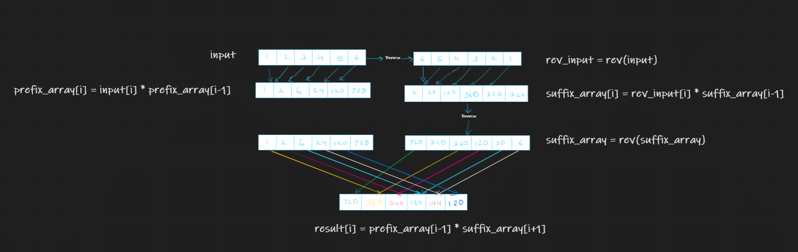

# Get products of all other elements

Given an array of integer, return a new array such that each element at index _i_ of the new array is the product of all the numbers in the original array except the one at _i_.

### Example:
if the input is:

[1, 2, 3, 4, 5]

the expected output should be:

[120, 60, 40, 30, 24]

_**Follow Up: solve without using division.**_

# Solution 

## Solution 1

The solution is simple, and can be done using 2 pass of the array, if we are allowed to use division.
 
Find the the product of all the numbers in an array (first pass), and then devide the product by each element to find the value at that position(second pass).

**Time complexity:** O(n)

**Space complexity:** O(1)

## Solution 2 
The second solution is a bit tricky, inorder to find the product of all other numbers except _i_ we need to find the product of all the prefix and product of all the suffix and multiple both.
The trick is how you can find the product of all previous numbers at an index(including the index) in a single pass and same to be done for number after the index.

Lets consurtuct a prefix array in which number at index _i_ is the sum of all previous numbers till index i including _i_.
and a suffix array in which number at index _i_ is the sum of all the upcoming numbers in the array including _i_:

Now the result can ealisy calculated using the two arrays:

result_array[i]=prefix_array[i-1] * suffix_array[i+1]

The algo can be represented by the following diagram:

**Time complexity:** O(n)

**Space complexity:** O(n)

